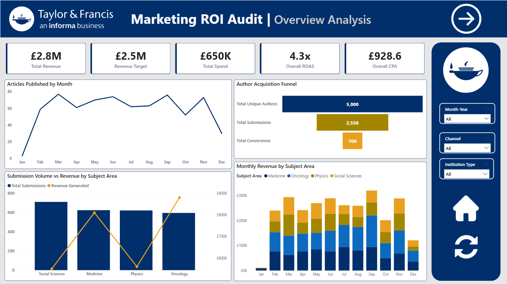

<p align="center">
  
</p>

<p align="center">
  
  &nbsp;
  
  &nbsp;
  
  &nbsp;
  
</p>

---

## Table of Contents

1. [Project Overview](#project-overview)
2. [Business Context and Problem Statement](#business-context-and-problem-statement)
3. [Data Overview](#data-overview)
4. [Project Architecture](#project-architecture)
5. [Tools and Technologies](#tools-and-technologies)
6. [Methods](#methods)
7. [Key Insights](#key-insights)
8. [Results and Conclusion](#results-and-conclusion)
9. [Dashboard and Report Preview](#dashboard-and-report-preview)
10. [How to Run the Project](#how-to-run-the-project)
11. [Author](#author)

---

## Project Overview

An end-to-end marketing ROI audit for Taylor & Francis, a publishing firm.
The project covers the full analytical pipeline - ETL, EDA, and customer
segmentation in Python, attribution modelling in SQL, and an interactive
business intelligence report in Power BI.

## Business Context and Problem Statement

Taylor & Francis invested across various marketing channels and campaigns to attract
academic authors and drive article submissions. This project audits that investment
to answer:

- Which marketing channels are generating positive ROI and which are loss-making?
- How much revenue can be attributed to each channel and campaign?
- Which author segments are the most commercially valuable?
- Are there distinct behavioural segments among authors?
- Which subject areas drive the highest submission volume and revenue?
- Which journals have the highest and lowest article acceptance rates?

## Data Overview

- 4 core tables: `authors`, `submissions`, `interactions`, `marketing_spend`
- 1 derived MySQL view: `submissions_attributed` - last-touch attribution output

## Project Structure

```
taylor-francis-marketing-analytics/
│
├── README.md
├── .gitignore
├── LICENSE
│
├── assets/
│   ├── banner.svg                              # Project banner
│   ├── Page1_Overview_Analysis.png             # Overview analysis screenshot
│   ├── Page2_Channel_Performance.png           # Channel performance screenshot
│   ├── Page3_Audience_Intelligence.png         # Audience intelligence screenshot
│   └── Page4_Campaign_Detail_Drillthrough.png  # Drill-through screenshot
│
├── data/
│   └── cleaned/
│       ├── cleaned_authors.csv
│       ├── cleaned_interactions.csv
│       ├── cleaned_marketing_spend.csv
│       └── cleaned_submissions.csv
│
├── python/
│   └── T&F ETL-checkpoint.ipynb               # ETL, EDA & K-Means clustering
│
├── sql/
│   ├── 01_Schema_and_Ingestion.sql             # Schema design & data ingestion
│   ├── 02_Last_Touch_Attribution.sql           # Last-touch attribution model
│   ├── 03_Channel_ROAS.sql                     # Channel ROAS analysis
│   └── 04_View_Creation.sql                    # MySQL view creation
│
├── powerbi/
│   └── T&F_BI_REPORT.pbix                     # Interactive Power BI report
│
└── report/
    └── TF_Marketing_ROI_Report.pdf             # Project analysis report
```

## Tools and Technologies

- **Python** - Pandas, NumPy, Matplotlib, Seaborn, Scikit-learn
- **MySQL** - Schema design, data ingestion, JOINs, CTEs, window functions, views
- **Power BI** - Data modelling, DAX, interactive visualisations

## Methods

- **Exploratory Data Analysis** - distribution analysis, missing value treatment,
  engagement trend investigation across author segments
- **ETL Pipeline** - data extraction, cleaning, transformation and loading into
  MySQL for downstream analysis
- **K-Means Clustering** - unsupervised segmentation of corporate authors into 3
  behavioural archetypes based on email and webinar engagement patterns
- **Last-Touch Attribution** - SQL-based attribution model assigning each
  published article's APC revenue to the channel of the author's most recent
  pre-submission marketing interaction
- **Star Schema Modelling** - relational data model built in Power BI with fact
  and dimension tables connected via active and inactive relationships
- **DAX Measures** - 23 custom measures across 6 categories covering revenue,
  channel attribution, funnel metrics and campaign performance

## Key Insights

- Email delivered a **28.57x ROAS** on £50,000 spend - the highest performing
  channel by a significant margin with a CPA of just £142 per published article
- Social Ads returned a **0.53x ROAS** on £400,000 - the largest budget allocation
  in the entire campaign but a net loss-making channel with a CPA of £7,692
- Corporate authors generate **55% of total revenue** despite being one of two
  primary institution segments
- Corporate Pharma Research Scientists are the single most valuable author segment
  with **£677,500 in attributed revenue**
- The High Intent Whale cluster (**875 users**) shows 13.48 average email opens -
  nearly 3x the baseline - confirming Email as the correct channel to target
  this segment
- Social Sciences has the highest journal acceptance rate at **31%** while Physics
  has the lowest at **23%**
- Oncology generates the highest revenue per subject area at **£880,000** despite
  not having the highest submission volume

## Results and Conclusion

- The audit reveals a significant budget misallocation across marketing channels.
The majority of spend is concentrated in the lowest-performing channel, while the
highest-performing channel receives a fraction of the budget. Redistributing
investment toward Email and Webinar Series - and reducing or eliminating Social
Ads spend - would materially improve overall marketing ROI.

- Corporate authors, particularly those in pharmaceutical research roles, represent
the most commercially valuable audience segment. Future campaigns should prioritise
this segment through targeted email outreach, aligned with the behavioural
segmentation findings from the cluster analysis.

- At the journal level, acceptance rate disparities suggest an opportunity to better
align author targeting with journal fit - directing authors toward journals where
their submissions are most likely to succeed, improving both author experience and
published article volume.

## Dashboard and Report Preview



## How to Run the Project

### Python
1. Clone the repository
2. Install dependencies:
3. Open and run the notebook in `01_python/`

### SQL
1. Create a new MySQL database:

2. Run scripts in order from `02_sql/`:
   - `01_schema_and_ingestion.sql`
   - `02_last_touch_attribution.sql`

### Power BI
1. Open `03_powerbi/TF_BI_REPORT.pbix` in Power BI Desktop
2. Update the MySQL connection string to your local server
3. Refresh all tables

## Author

**Utkarsh Pandey**<br>
Data Analyst

[](https://github.com/utkarshisatwork)

